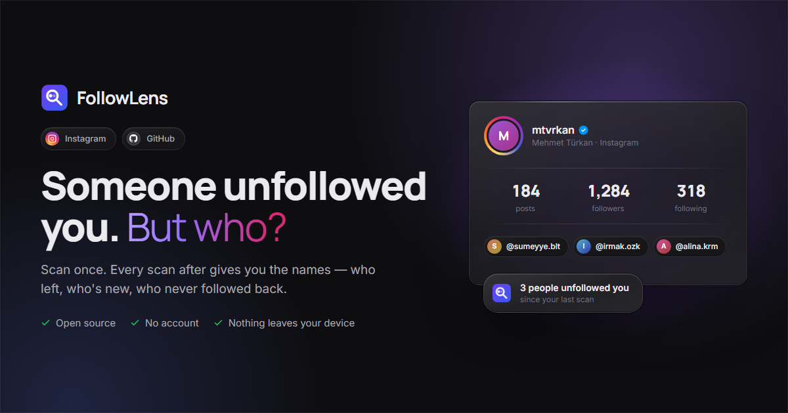

# FollowLens

**See who doesn't follow you back — and who quietly unfollowed you.**
Instagram and GitHub. Entirely on your device: no server, no account, no analytics.

[**Website**](https://followlens.mtvrkan.com) · [**Install**](INSTALL.md) · [**Privacy policy**](PRIVACY.md) · [**Changelog**](CHANGELOG.md) · **[Türkçe](README.tr.md)**

---

Instagram tells you the number. FollowLens tells you the names.

It reads the follower and following lists you open, keeps them in your own browser, and from the second scan on shows you exactly what changed. There is no server to send anything to — there is no backend in this project at all.

## What you get

**Who unfollowed you** — save a scan; every scan after it answers the question the platform will not: who left, who is new, who never followed back, and who is mutual.

**Auto-Collect** — one click walks the list for you. A badge on the page shows progress the whole time, and Stop always works. Nothing ever starts on its own.

**Any profile you can open** — your own account, or any profile whose lists already open for you. It cannot read a list you could not read yourself.

**Honest about gaps** — a platform's header count can include accounts its list endpoint never returns. FollowLens shows what it collected against what was expected, and will not call a list complete when it knows it is not.

**History and comparison** — growth chart, per-scan changes, a narrowable date range, and any two scans side by side in both directions.

**Export** — CSV, JSON, a printable HTML report, PDF, or a full backup that restores on another machine.

**Multi-account** — Instagram and GitHub, any number of accounts, each with its own separate history.

**Ten languages** — en · tr · de · es · fr · pt-BR · ru · ja · zh-CN · ar, right-to-left included. Light, dark and system themes.

## How it works

1. **Open a profile** — your own, or any whose lists already open for you.
2. **Click FollowLens and press Start.** The list is opened and walked for you. A badge on the page shows progress, and Stop always works.
3. **Save the scan.** It becomes your baseline. Every scan after it answers the question the platform will not.

## Privacy

Everything stays in your browser — IndexedDB plus `chrome.storage.local`. No account, no sign-in, no analytics, no telemetry. Your scans are deleted when you delete them, and removing the extension takes them with it.

The only requests FollowLens makes go to the platform you already have open. [PRIVACY.md](PRIVACY.md) lists every one of them and why it exists.

It only reads. There is no code path that posts, follows, unfollows, likes or messages on your behalf.

## Install

The Chrome Web Store listing is [in review](https://chromewebstore.google.com/detail/jpejnlkciiphkcnlncljikpgekbcglfl). Until it is approved, installing from source takes about a minute — see **[INSTALL.md](INSTALL.md)**.

Tested on Chrome and Brave.

## Why not TikTok and X

Both were supported and both were removed. X padded short follower lists with algorithmic "who to follow" suggestions that nothing in the response reliably separated from real entries. TikTok's only workable path was intercepting an API whose requests it signs with an obfuscated, frequently-rotated scheme.

Neither could be made to produce follower data worth trusting, and a wrong "doesn't follow back" answer is worse than no answer.

## More

- [INSTALL.md](INSTALL.md) — install, update, remove, and the development setup
- [CONTRIBUTING.md](CONTRIBUTING.md) — architecture, house rules, adding a platform
- [PRIVACY.md](PRIVACY.md) — what is stored, and every request the extension makes
- [DECISIONS.md](DECISIONS.md) — the non-obvious calls, and why they went that way
- [CHANGELOG.md](CHANGELOG.md) — what shipped
- [docs/](docs/README.md) — the landing page

## License

[MIT](LICENSE) © Mehmet Türkan ([mtvrkan](https://mtvrkan.com))
